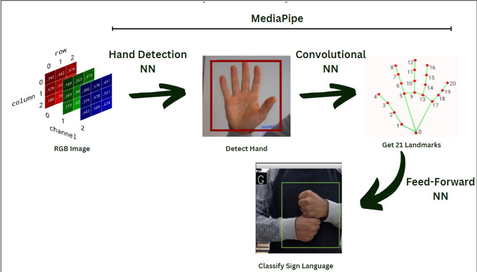
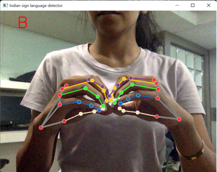
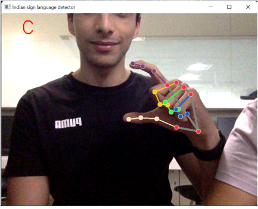

## Indian Sign Language Detection using Mediapipe

This project is aimed at detecting and recognizing Indian Sign Language (ISL) gestures using the Mediapipe library. The project is implemented in Python.


### Requirements

To run this project, you will need the following dependencies:

- Python 3.6 or higher
- Mediapipe library
- OpenCV library
- Numpy library

### Installation

1. Install Python 3.6 or higher on your system.
2. Install the Mediapipe library using the following command:

   ```
   pip install mediapipe
   ```

3. Install the OpenCV library using the following command:

   ```
   pip install opencv-python
   ```

4. Install the Numpy library using the following command:

   ```
   pip install numpy
   ```

### Usage

1. Clone the repository to your local machine.

2. Open the command prompt and navigate to the cloned directory.

3. Run the following command to start the program:

   ```
   python isl_detection.py
   ```

4. The program will start and display the video stream from the webcam.

5. To exit the program, press the 'q' key.

### How it works

The program uses the Mediapipe library to detect landmarks on the hand and fingers of the user in real-time. These landmarks are then fed into a feedforward neural network (FNN) that was trained on an Indian Sign Language (ISL) dataset from Kaggle. The FNN predicts the class of the hand gesture based on the detected landmarks.

During execution, the program uses the webcam to capture video frames, applies the Mediapipe hand detection model to detect the hand in each frame, and extracts the hand landmarks. The extracted landmarks are then passed to the classification model, which predicts the class of the hand gesture. The predicted class is displayed on the video stream in real-time.



## File Descriptions

- `isl_detection.py`: This file is the main python file for real-time ISL detection.
- `dataset_keypoint_generation.py`: This file converts [ISL kaggle image dataset](https://www.kaggle.com/datasets/prathumarikeri/indian-sign-language-isl) to 42 landmarks.
- `keypoint.csv`: This file contains the 42 landmarks for all images.
- `ISL_classifier.ipynb`: The notebook is used to create a classifier model to classify the hand gestures.
- `model.h5`: This is the classifier model.

### Examples



### Future Improvements

The following improvements can be made to the project:

- Expand the dataset to include more examples of each ISL gesture to improve the accuracy of the classification model.
- Implement a more sophisticated model architecture, such as a convolutional neural network (CNN), to improve the accuracy of the classification model.
- Add support for more ISL gestures.
- Implement a feature to convert the recognized gestures into text or speech.
- Make the program more user-friendly by adding a GUI.

